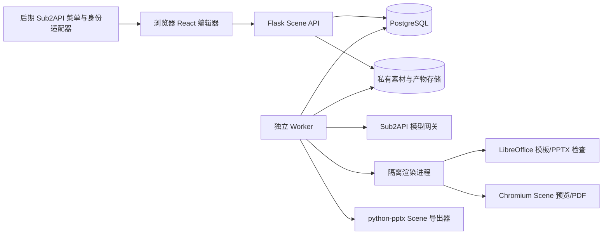
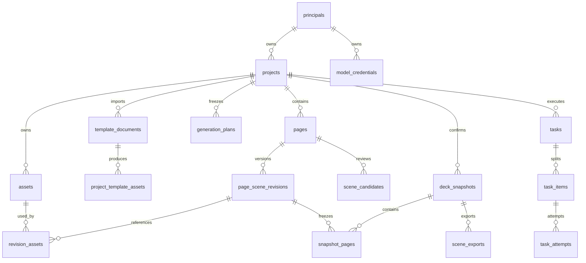

# Web PPT 编辑器产品与技术设计

> **当前交付边界（用户于 2026-10-03 更新）**：先完成功能代码与离线回归；Linux Docker 部署及 renderer 隔离安全、PostgreSQL 实际并发、干净 Linux 数据库与资产备份恢复、PowerPoint/WPS 实机及跨引擎视觉一致性、真实 Sub2API 调用/扣费/结果未知、指定 33 页 PPTX 的 Linux LibreOffice 转换（含第 6/22/30 页复核）六类环境验收全部延期，待用户提供环境后开展。保留功能、质量门和测试入口，不将延期验收作为当前代码交付的阻塞项，也不将延期视为已通过。下文原设计与实施顺序是需求基线；历史测试状态见实施文档。

> 日期：2026-10-02。状态：需求边界已由用户确认；本文是待实施的技术基线，不代表相关功能已经完成。  
> 适用项目：Banana Slides；后续通过 Sub2API 自定义菜单嵌入。  
> 背景分析：[可编辑 PPTX 技术分析](./editable-pptx-technical-analysis.md)。本文承接其中的“路线 B：前向结构化生成”，不把旧图逆向识别作为首版主链路。  
> 证据范围：当前工作区代码静态核对、指定 PPTX 包结构检查；未运行参考模板的 Linux 渲染、模型调用或新编辑器端到端测试。下文标记为“新增／拟采用”的内容均需实现和验收。

**技术导航**：[架构](#3-总体架构与技术选择) · [Scene 合同](#6-统一页面模型-slidescene) · [数据库/ER/字段](#7-数据库与存储设计) · [并发控制](#8-版本锁与并发控制) · [API](#9-api-契约) · [任务恢复](#11-异步任务故障恢复与计费幂等) · [导出实现](#12-pptx-与-pdf-导出实现) · [验收](#13-质量门与可执行验收) · [Sub2API](#14-访问安全凭据与-sub2api-集成)。

## 1. 目标、已确认需求与不做事项

### 1.1 交付目标

提供一个浏览器中的轻量 PPT 创作工具：用户用自然语言描述需求，选择 PPTX 或图片参考模板，确认大纲后生成单页、指定多页或全部页面；在对象画布中修改文字和图片对象；确认最终版本后导出文字可编辑的 PPTX，或含可搜索文字层的 PDF。

首版先供单个所有者受限访问，正式运行在 Linux / Docker，本地 Windows 开发。后续接入 Sub2API 的菜单 iframe、账号和用户隔离，模型调用使用用户自己的 Sub2API API Key，费用计入该 Key 所属用户额度。

### 1.2 需求决策记录

| 决策 | 已确认内容 | 工程含义 |
| --- | --- | --- |
| Q1、Q5 | 以新生成为主；支持上传 PPTX、参考图片；模板只作风格参考 | 不做任意 PPTX 无损导入或严格占位符填充；模板渲染与风格分析是独立服务 |
| Q2 | 轻量对象画布 | 文本直接编辑；对象移动、缩放、增删、层级、撤销；不是仅修改大纲或重新生整页图 |
| Q3、Q12 | 标题、正文、独立标注为原生文本 | 图片内部的图表标签、插画文字不承诺原生编辑；导出前明示 |
| Q4、Q13 | 可编辑 PPTX、可搜索/复制文字的 PDF | 图片型 PPTX 不是新流程必需出口；图片型 PDF 不能替代本设计的文字层 PDF |
| Q6 | AI 生成配图/背景；模板可为 PPTX 或图片 | 不采用含正文的整页生图作为新流程主结果；主文字由 Scene 绘制 |
| Q7 | 图表、图标先作为独立图片对象 | 可移动、缩放、替换；图表数据编辑仅列后续备选，不是首版交付项 |
| Q8、Q14 | 先单用户独立使用，后接 Sub2API | 首版没有注册系统；从数据层开始记录 owner，单用户模式也必须限制访问 |
| Q9 | 用户自己的 API Key、用户自己的额度 | 面板登录凭证不等于模型 Key；后端保存/调用 Key，不自动创建或复用平台管理员 Key |
| Q10 | 先确认大纲和模板，再生成选中页或全部 | 保存不可变生成计划；单页/多页共用任务协议 |
| Q11 | AI 修改产生候选，确认后替换；撤销、对象锁定 | AI 不直接写当前版本；采用基版本校验和乐观并发控制 |
| Q15 | Linux / Docker 部署，Windows 开发 | 服务端不依赖 PowerPoint COM；渲染环境和字体需固定 |

### 1.3 首版不做

- 任意已有 PPTX 的编辑往返、母版/动画/视频编辑、自动播放模板音乐。
- 旧整页图片的一键全对象还原；旧项目仍可使用原有图片导出，但不得冒充 Scene 原生项目。
- 原生 PPT 数据图表、复杂矢量路径编辑、多人实时协作、独立会员/收费系统。
- PDF/PPTX 的防复制、防截图或绝对防修改承诺。
- 在没有真实数据时自动编造业务图表数值；缺失数据应提示补充，示例须明确标记。

### 1.4 工程默认值与可配置边界

以下是实现默认值，不是已测出的容量承诺：默认中文、16:9；新建时可选择受支持的画幅，项目内统一尺寸。生成页数由用户确认，封面/目录/结束页计入总页数；单页不自动附加封面。初始配置建议生成上限 30 页、模板导入上限 50 页、单文件 50 MiB；这些限额独立且可配置，需经压测调整。模板样本的 33 页是参考库页数，不要求生成 33 页。

首版不承诺固定生成耗时；进度按实际页和阶段展示。每个 owner 默认至多 2 个在途模型调用，可按代理限流降低。改变画幅、全局字体或模板，不静默改写已有页面，而是触发显式重新布局/候选生成。

## 2. 现状、复用点与差距

### 2.1 当前代码事实

| 能力 | 当前事实 | 本设计处理 |
| --- | --- | --- |
| Web 技术栈 | React 18、TypeScript、Vite、Zustand；Flask、SQLAlchemy | 继续复用，不迁移成 Sub2API 的 Vue/Go 代码 |
| 创作流程 | 已有需求→大纲→描述→单页/批量生图 | 复用输入、大纲、页管理和 Provider 接口，新增 Scene 生成分支 |
| 页面数据 | `pages` 分存大纲、描述、图片路径 | 新增不可变 Scene 版本；图片路径仅为旧流程或派生预览缓存 |
| 网页编辑 | 主视图是整页图片；修改通过重新生图实现 | 新建对象编辑器，不以旧图片编辑组件冒充对象级编辑 |
| 模板 | 已有图片/PDF 拆页模板库和逐页选择；PPT 翻新入口会转静态图 | 复用模板选择，新增正式的 PPTX 参考模板导入与来源记录 |
| PPTX | 图片、按大纲重排、图片识别三条出口 | 新增 Scene 原生文字出口，不调用旧的大纲重排实现 |
| PDF | 当前从 `generated_image_path` 用 img2pdf/Pillow 合成 | 新增 Scene→HTML→PDF 文字层出口 |
| 异步 | 数据库有 Task；执行为进程内线程池 | 新流程采用持久化任务项和独立 worker，支持重启恢复 |
| 身份 | 非多租户，Project 没有 owner；`/files` 不等同于对象授权 | 增加 owner、统一资源授权，不能只保护 HTML 页面 |

### 2.2 与既有逐页模板设计的关系

保留 `projects.template_mode`、`pages.template_asset_id`、`template_style_text` 和 `project_template_assets` 的既有语义。历史逐页模板文档描述的是旧图片生成流程，不意味着本次必须实现原母版或复杂 SVG 编译器。

模板当前分析的区域多为 `top/left` 等粗粒度描述，不能直接当成新画布 bbox。新设计增加有版本的风格分析结果；生成计划锁定当时的分析 JSON 与素材 hash，避免用户后来修改模板分析时影响在途任务。

## 3. 总体架构与技术选择

### 3.1 架构图



任务入库和任务领取以 PostgreSQL 为准，不依赖 Web 进程内存。渲染作业禁止外网；只有模型 worker 获准访问配置的 Provider。原文件、模板预览、生成素材、Scene 预览和导出文件使用不同存储对象，不相互覆盖。

### 3.2 技术决策表

| 层 | 拟采用 | 原因与限制 |
| --- | --- | --- |
| 编辑器 | React + TypeScript + Zustand；DOM 文本/图片绝对定位 | 首版只有文字和图片，便于中文输入与 PDF 保留文字；无需先实现通用画布引擎 |
| 交互覆盖层 | 独立选框/手柄层，必要时用 SVG 画辅助线 | SVG 仅作交互覆盖，不作为第二份页面内容；不将整个页面导成截图 |
| 页面数据 | 受限、版本化 `SlideScene` JSON Schema | 编辑器、生成器、导出器共享合同；模型不能输出任意 HTML/脚本 |
| 后端 | Flask + SQLAlchemy + Alembic | 复用现有项目；新服务模块与旧图片路径隔离 |
| 正式数据库 | PostgreSQL | 支持 JSONB、行锁、任务领取与并发控制；旧 SQLite 需显式迁移 |
| 持久化任务 | PostgreSQL 任务项 + 独立 Python worker + lease/fencing | 首版无需额外 Redis；不是现有线程池“加重试”即可完成 |
| 模板静态化 | 固定版本 LibreOffice + PyMuPDF | 仅提取静态参考，禁外链更新；转换不等于母版继承 |
| 页面预览/PDF | 固定版本 Chromium + Playwright，复用只读 SceneRenderer | HTML 文本保留文字层；等待字体和图片全部加载后输出 |
| PPTX | `python-pptx` 的独立 Scene exporter | 文字→文本框，素材→图片；不从大纲重排，不将 DOM 截图当原生文字 |
| 字体 | 经许可可分发的固定字体包，例如 Noto Sans CJK SC | 前后端与渲染容器共享字体版本；PPT 客户端仍需安装/替代检查 |
| 文件 | 首版私有本地 volume + `AssetStore` 接口 | 不依赖公网静态目录；未来可换 S3，不把本地绝对路径写入 Scene |

SQLite 可继续运行旧模式或轻量单元测试，但**不作为新多进程队列的正式部署配置**。Windows 开发通过 Docker 启动 PostgreSQL 与 Linux 渲染 worker，前端/API 可在宿主机运行；关键验收统一在 Linux 容器内执行。

### 3.3 模块职责

- `SceneService`：schema 校验、手工保存、锁校验、版本分配、head CAS。
- `GenerationPlanService`：确认大纲/模板，保存生成输入快照。
- `TemplateImportService`：文件检查、静态化、逐页参考资产、风格分析。
- `GenerationService`：生成 Scene 草稿和资产请求；完成资产后创建候选版本。
- `CandidateService`：差异预览、接受/拒绝、过期候选校验；不得绕过 SceneService。
- `SnapshotService`：冻结已确认页序、Scene 版本、资产及字体清单。
- `ExportServiceV2`：只读快照，产生 PPTX/PDF 和质量报告。
- `CredentialService` / `IdentityAdapter`：模型凭据与用户身份分离。
- `WorkerRunner`：持久化调度、超时、取消、重试、预算与速率限制。

## 4. 页面与交互设计

### 4.1 页面组织

1. **项目列表**：新建、继续编辑、归档/删除；首版所有项目属于受限单用户。
2. **创建与大纲页**：需求、总页数、用途、风格、模板、模型设置；可修改标题/要点、插入/删除/排序页面。
3. **模板库**：上传 PPTX 或图片；查看导入进度与字体告警；选择参考页，自动匹配封面/目录/正文/结束页并允许人工改选。
4. **对象编辑器**：左侧页缩略图与任务状态，中间画布，右侧对象属性/AI 修改，顶部撤销/重做/保存/导出。
5. **确认与导出面板**：选择页、列出可编辑范围与阻断项，确认快照，下载 PPTX/PDF。

可在现有路由旁新增 `/projects/:id/editor`；旧图片项目继续进入旧预览页。嵌入模式通过 `ui_mode=embedded` 隐藏重复导航，不改变授权规则。

### 4.2 编辑器操作合同

| 对象 | 首版支持 | 不支持 |
| --- | --- | --- |
| 文字 | 直接输入/粘贴纯文本；字体、字号、粗体、颜色、对齐、行距；移动/缩放文本框；换行 | 任意 HTML、自由富文本嵌套、竖排、复杂 WordArt；超出支持集明确提示 |
| 图片/图表/图标 | 上传或选择替换、移动、等比缩放、裁剪、旋转、删除、前后层级 | 图表内部数据编辑、像素内容编辑、图标路径编辑 |
| 背景 | 纯色或无正文文字的图片；替换 | 动态视频、模板播放动画 |
| 多选 | 批量移动、删除、排列层级；支持撤销 | 首版不落地任意嵌套分组模型 |
| 锁定 | 整个对象的内容与几何都锁定；显式解锁后才可改 | 模型自行解除锁定 |

拖动/缩放过程中只更新本地草稿，结束一个操作才进入 undo 栈并触发保存。文本采用受控输入覆盖层，显示和打印采用同一只读排版组件；中文 IME 在 `compositionend` 后提交，不按拼音中间态保存。

首版文字框使用统一文本样式，多段可换行；混合多字体/局部富文本仅在另行扩展 schema 后加入。调整文本框尺寸不自动缩小字号来掩盖溢出，提供扩大文本框、精简内容或拆页建议。

### 4.3 自动保存与候选确认

- 建议空闲 800 ms 自动保存，失焦立即保存；显示“保存中/已保存/冲突/离线草稿”。数值是可调体验参数。
- 有未确认保存的本地编辑时，生成 AI 修改/创建导出快照前先 flush，失败则阻止继续。
- 首次生成和后续 AI 改写均产出候选；候选有单独预览，接受后才成为当前 head。首次可批量接受，但后台须逐页做基版本和锁校验。
- 局部修改必须指定 page_id、element_ids 和 scope；默认只改选中对象，无选择时只改当前页。跨页重生成必须显式选择页面。
- 旧 head 与候选同屏比较；接受后可撤销。撤销是基于当前 head 产生一份恢复版本，不删除历史记录。
- 自动保存的历史与会话内 undo 不等同：会话内有动作级撤销/重做，刷新后至少可通过已保存版本恢复。

### 4.4 用户可见状态

项目 UI 状态由页面/任务状态汇总，不新增一套可与数据库事实矛盾的权威状态：大纲待确认、可生成、生成中、候选待确认、可编辑、导出检查中、可下载。部分失败时保留成功页，支持只重试失败页；不能静默跳过失败页后宣称整份成功。

## 5. PPTX/图片参考模板处理

### 5.1 输入与样本结论

首版明确接受 `.pptx`、PNG/JPEG/WebP 静态图片；旧 `.ppt`、加密演示文稿、宏文件 `.pptm` 不纳入新模板入口，提示用户另存为 PPTX。既有 PDF 模板入口保持兼容，但不是本次新增能力的验收重点。

指定样本：`tmp/1-商务通用工作汇报13-动态——亮亮图文旗舰店.pptx`。

| 项目 | 静态检查事实 | 设计影响 |
| --- | --- | --- |
| 来源 | 6,159,995 字节；SHA-256 `bb5e048aa4cf73898f8a603088d2e304beca5f7008b127a5026ebd6f378d8135` | 导入、缓存和验收锁定原文件 hash |
| 画幅/页数 | 33 页，16:9，10 × 5.625 英寸 | 支持多页参考库；不把模板页数当生成页数 |
| 对象 | 594 个形状，其中 324 个有文字；107 个组合、9 个图片对象、5 个图表 | 不能只解包 media 当作页面，必须真正静态渲染 |
| 模板结构 | 1 个母版、7 个布局；实际使用的布局和幻灯片没有占位符 | 不适合假定“自动填占位符”；符合风格参考路线 |
| 动画/媒体 | 所有页有动画时间线，含进/退场和路径；含 MP3 与异常外部 video 关系 | 取静态编辑视图，不播放动画/音频，不声称“最终动画帧” |
| 外部数据 | 部分图表关系指向原作者机器的外部 XLSX，图表有数值缓存 | 阻止刷新外部链接；使用已有缓存，渲染不足则告警 |
| 字体/效果 | 微软雅黑、宋体等未嵌入；第 6 页有 WDP/PNG 回退与图片效果 | 记录字体替换，选第 6、22、30 页为重点兼容样本 |

此处只证明包结构，不证明 LibreOffice 已正确渲染；首次实施应保留原文件不变并做真实转换对照。

### 5.2 导入流水线

```text
上传原文件
  → MIME/包结构/体积检查、计算 hash、写私有原始资产
  → 创建 template_document + 持久化导入任务
  → 隔离 LibreOffice 静态转换为 PDF（不播放、不更新外链）
  → PyMuPDF 按页生成参考图/缩略图，记录画幅、渲染器与告警
  → 用户选择参考页（避免无必要的逐页付费模型分析）
  → 多模态模型分析风格/布局/容量；可人工修正
  → 作为 project_template_assets 入库
  → 生成计划锁定参考图与分析版本
```

图片入口跳过 Office 转换；统一方向、色彩空间与像素上限，保留原图和规范化图各自 hash。多帧/动态图片不纳入首版，避免首帧与用户预期不一致。

所有页可以先生成本地缩略图，但只分析用户选择的页。封面/正文等角色可以自动建议，用户可以为每个生成页改选参考。分析失败不冒充精确 bbox：显示“未分析”，允许用户明确选择“仅参考图片”继续并提示质量不确定。

### 5.3 风格分析数据合同

`TemplateStyleProfile v1` 至少包括：

- `schema_version`、`source_asset_id/hash`、`analysis_model`、`analysis_version`。
- `role`：cover / agenda / section / content / closing / unknown。
- `palette`：背景、正文、强调色；`font_suggestions`：检测/推测字体、来源及置信度。
- `layout_hints`：归一化区域 `[x, y, w, h]`，元素用途、建议文字容量；它是建议，不是原 PPT 对象的精确反解。
- `decorative_hints`、`content_density`、`warnings`、人工修订记录。

模型分析不能把模板内的示例标题、年份、商店文案和图表数值当作新项目内容。模板图片也不能不经处理直接铺底后叠正文：它可能仍含示例文字。优先生成新的无正文背景/装饰素材；需要保留精确 Logo 时由用户另行提供干净素材，不承诺从截图无损抠出。

### 5.4 转换隔离

- 检查 ZIP 路径、条目数、累计解压尺寸、压缩比、外部关系、嵌入对象；拒绝超限和路径穿越。
- 转换进程使用独立工作目录与 LibreOffice profile，禁宏/外链更新、只读输入、无外网、低权限、CPU/内存/PID/时间上限。
- 不能仅靠 `--headless` 视为安全隔离。上传内容、模板文本和模型返回均是数据，不执行其中指令。
- 单作业超时杀死该进程组并清理其临时目录；禁止影响其他并发作业。
- 将具体 renderer 版本、字体包版本、原图 hash、转换日志摘要写入导入报告；模板文件未真实渲染成功前不可标为 ready。

## 6. 统一页面模型 SlideScene

### 6.1 真值与单位

`SlideScene` 是新项目唯一的画面内容真值。大纲是生成输入，不是导出输入；缩略图/PNG/PDF/PPTX 都是派生产物。浏览器内部状态可以有选框、缩放、输入光标，但不能把这些 UI 状态存进 Scene。

- 坐标、字号、边距统一使用 **pt**；`1 pt = 1/72 inch = 12700 EMU`，CSS 显示换算为 `pt × 96/72 px`，再乘编辑器 zoom。
- 默认画布 960 × 540 pt；参考模板的 16:9 比例相同不要求物理英寸完全相同。若选择其他比例，在项目创建时确定宽高。
- 数值必须有限、范围受限；pt 几何值精度为 0.01 pt，旋转为 0.01 度，crop/opacity 等归一化值保留至 6 位小数。image crop 使用 0～1 的源图归一化坐标，不能按 0.01 pt 的规则误量化。
- `elements` 数组顺序为从后往前的层序；不另存可冲突的 z 字段。背景永远在元素后面。
- 每个元素有稳定 UUID；复制元素分配新 ID，移动/修改保持 ID。
- `font_manifest_id` 指定字体文件、face 与 hash；不允许浏览器“碰巧安装的字体”成为隐式输入。

### 6.2 v1 示例

下面是可解析的合同示例，不是现有数据库中的页面；示例 asset/font ID 在真实保存时必须解析为有效资源。

```json
{
  "schema_version": 1,
  "font_manifest_id": "fonts-v1",
  "canvas": {"width_pt": 960, "height_pt": 540},
  "background": {"kind": "solid", "color": "#F8FAFC"},
  "elements": [
    {
      "id": "11111111-1111-4111-8111-111111111111",
      "kind": "image",
      "role": "illustration",
      "asset_id": "22222222-2222-4222-8222-222222222222",
      "frame": {"x": 580, "y": 150, "w": 320, "h": 280, "rotation_deg": 0},
      "crop": {"x": 0, "y": 0, "w": 1, "h": 1},
      "fit": "contain",
      "opacity": 1,
      "locked": false,
      "alt_text": "团队协作插画"
    },
    {
      "id": "33333333-3333-4333-8333-333333333333",
      "kind": "text",
      "role": "title",
      "frame": {"x": 60, "y": 50, "w": 830, "h": 65, "rotation_deg": 0},
      "text": "季度工作汇报",
      "style": {
        "font_family_id": "noto-sans-sc",
        "font_size_pt": 34,
        "font_weight": 700,
        "color": "#17324D",
        "align": "left",
        "vertical_align": "top",
        "line_height": 1.2,
        "padding_pt": 0
      },
      "locked": false
    },
    {
      "id": "44444444-4444-4444-8444-444444444444",
      "kind": "text",
      "role": "body",
      "frame": {"x": 60, "y": 160, "w": 460, "h": 200, "rotation_deg": 0},
      "text": "本季度重点工作\n待补充：已完成事项与真实业务数据",
      "style": {
        "font_family_id": "noto-sans-sc",
        "font_size_pt": 22,
        "font_weight": 400,
        "color": "#334155",
        "align": "left",
        "vertical_align": "top",
        "line_height": 1.4,
        "padding_pt": 0
      },
      "locked": false
    }
  ]
}
```

### 6.3 Schema 与渲染子集

使用 JSON Schema 2020-12 管理，后端以该 schema 校验，TypeScript 类型从同一合同生成并提交产物。`additionalProperties: false`；增加新 kind 必须升 schema/能力版本，旧导出器不支持时明确报错，不静默丢弃。

| 字段/对象 | 限制与语义 |
| --- | --- |
| `canvas` | 与项目尺寸一致，宽高大于零且在配置上限内；不能在单页里偷换比例 |
| `background` | `solid` 或 `image`；image 必须指向 owner 可访问的不可变资产，按 cover 计算裁剪 |
| `frame` | `x/y/w/h` 为 pt，w/h > 0；首版默认禁止对象完全在画外；文字越界为导出阻断项 |
| 旋转 | 图片允许受限角度；文字 v1 仅 0 度，UI 与 API 一致，不承诺未支持的旋转文字排版 |
| `text` | 纯 Unicode 文本；拒绝非法控制字符，不解释 HTML/脚本/模板指令；显式换行保留 |
| 文本样式 | 一个文本框一个样式；字体必须可解析；字号、行高、颜色与长度设上限 |
| `crop/fit` | 先按归一化 crop 取源图区域，再按 contain/cover 布局；contain 保留完整比例与空白，cover 裁切到框 |
| `opacity` | 图片 0～1；PPTX 不支持的透明处理可生成透明度派生 PNG，但不得压扁整页文字 |
| `locked` | 禁止手动/AI 的内容、位置、尺寸、层级、删除操作；显式解锁是单独命令 |
| `role` | text: title/body/annotation；image: background/illustration/chart/icon/photo/decoration；只描述用途，不冒充编辑级别 |
| 资源 | 只允许 asset_id，不接收外部 URL、本机路径、base64 巨型内联、SVG 脚本 |

首版支持 PNG/JPEG/WebP，导出时按能力转为保真 PNG/JPEG 派生资产；导入 SVG 如需开放，先禁脚本/外链并栅格化，不能把任意 SVG 原样注入 DOM。

### 6.4 内容、布局与渲染一致性

`scene_hash = SHA256(canonical(scene_json))`。canonical 采用 RFC 8785 JCS，先执行 schema 规定的数值精度规范化，再按统一键序和 UTF-8 编码求 hash；数组顺序保留，文字不擅自归一化/改写。前后端须用同一组包含中文、浮点数和换行的 golden fixture 验证 hash 一致。版本 ID、生成时间、preview URL 不放入 hash 输入，hash 本身也不放入 Scene，避免循环依赖。

文本最终排版由固定字体的 Chromium 预检计算，输出派生 `TextLayout`：每行对应源文本区间、换行类型、字号、line box、baseline、字体解析结果。文本区间统一为 Unicode code point 偏移（左闭右开），前端显式转换 JavaScript UTF-16 索引，禁止在 surrogate pair/字素簇中间断行。缓存键为 `scene_hash + font_manifest_hash + layout_engine_version`，改变任何输入都须重算。自动折行不改写业务文字；原生 PPTX 根据已测 line breaks 设置软换行、行距和文本框边距，避免 Office 再自动缩字。

`TextLayout` 不是第二份可编辑内容；不能直接编辑缓存。浏览器、PDF 与 PPTX 字体度量仍可能不同，因此“同源”不等于“像素必然相同”，必须执行第 13 节质量检查。

## 7. 数据库与存储设计

### 7.1 约定与关系

正式数据库使用 PostgreSQL。为兼容当前模型，业务 ID 统一为 UUID 字符串 `varchar(36)`，不在本次强制把旧表 ID 转 PostgreSQL UUID 类型。新增时间字段使用 UTC `timestamptz`，旧无时区时间迁移时明确按 UTC 解释。新 JSON 使用 JSONB；旧 JSON 文本字段暂不强制整体替换。

新表默认有 `id`、`created_at`；可变实体另有 `updated_at`，可软删除实体有 `deleted_at`。下表列出其余主要字段、空值和约束；实现须据此生成 Alembic migration，而不是只向 Page 增加一个无版本 `scene_json` 字段。



`projects.owner_id` 是资源归属的权威。子实体的 owner/project 冗余字段仅用于索引与授权加速，必须在服务端/复合外键处保证一致，不能由浏览器自由填写。未来接入账号不重写这些业务主键。

### 7.2 所有者与模型凭据

**新增 `principals`**

| 字段 | 类型/空值 | 说明 |
| --- | --- | --- |
| `kind` | varchar(24), NOT NULL | 首版 `local_owner`；后续 `sub2api_user` |
| `display_name` | varchar(200), NOT NULL | 显示名称，不作鉴权凭据 |
| `status` | varchar(20), NOT NULL | active / disabled |
| `external_issuer` | varchar(255), NULL | 后期明确的身份签发方，不使用浏览器传入的任意 URL |
| `external_subject` | varchar(255), NULL | 后期 Sub2API 稳定用户 ID |

对非空 `(external_issuer, external_subject)` 建唯一索引。首版安装生成唯一 local owner，所有 API 从受验证的访问会话映射到它，不接受请求体指定 owner。这里只是业务主体，不建立注册/密码找回系统。

**新增 `model_credentials`**

| 字段 | 类型/空值 | 说明 |
| --- | --- | --- |
| `owner_id` | FK principals, NOT NULL | 私有模型凭据 |
| `provider_kind` | varchar(32), NOT NULL | 首版 `sub2api_openai_compatible` |
| `base_url` | text, NOT NULL | 受管理员 allowlist 限制的网关地址 |
| `label` / `key_suffix` | varchar, NOT NULL | UI 仅显示名称和尾部脱敏信息 |
| `encrypted_secret` / `nonce` | bytea, NOT NULL | AES-256-GCM 密文与独立随机 nonce；关联数据包含 owner/id |
| `key_version` | varchar(32), NOT NULL | 服务端加密主密钥版本，主密钥不存 DB |
| `secret_fingerprint` | varchar(64), NOT NULL | 服务端 HMAC 指纹，用于重复检测，不输出给无关用户 |
| `capabilities_json` | jsonb, NOT NULL | 实测/配置的文本、图片、结构化输出能力及检查时间，不代表永久可用 |
| `status` / `last_checked_at` | varchar / timestamptz NULL | unknown / usable / invalid / revoked |

普通 GET、导出、日志、任务 manifest 不返回明文 Key。删除凭据先撤销并阻止新调用；在途任务显示凭据撤销状态，不切换成平台 Key。模型 Key 不应和旧全局 Settings 的共享密钥混用。

### 7.3 扩展 `projects` 与 `pages`

**`projects` 新增字段**

| 字段 | 类型/默认 | 说明 |
| --- | --- | --- |
| `owner_id` | FK principals, 最终 NOT NULL | 迁移先可空、回填、再加约束 |
| `editor_mode` | varchar(20), NOT NULL | 旧数据 `legacy_image`；新入口 `scene_v1` |
| `row_version` | bigint, 0 | 大纲、页序、项目属性、模板绑定等计划输入变化时递增 |
| `canvas_width_pt` / `canvas_height_pt` | numeric(10,2), NULL for legacy | 新项目必填；不能只靠任意比例字符串推断导出尺寸 |
| `font_manifest_id` | varchar(64), NULL for legacy | 固定字体集合版本 |
| `default_credential_id` | FK model_credentials, NULL | 引用同 owner；生成前必须选择可用凭据 |
| `model_config_json` | jsonb, NOT NULL default `{}` | 文本/图片模型、允许的生成参数；不含 Key |
| `active_plan_id` | FK generation_plans, NULL | 最近确认的不可变计划；project 变化后可标计划已过时 |
| `deleted_at` | timestamptz, NULL | 软删除后禁止新任务，等待引用和任务清理 |

原 `creation_type`、`template_mode`、大纲相关字段保留。旧 `status` 可继续服务旧 UI；新 UI 根据实际计划、候选和任务汇总状态，不以它判断能否导出。

**`pages` 新增字段**

| 字段 | 类型/默认 | 说明 |
| --- | --- | --- |
| `head_revision_id` | FK page_scene_revisions, NULL | 当前已接受/手工保存的 Scene；未接受首次候选时为空 |
| `row_version` | bigint, 0 | Scene、锁、页面大纲、模板选择等影响候选的变化时递增 |
| `next_scene_seq` | bigint, 1 | 在短事务行锁内分配版本展示序号；分配本身不改变 row_version |
| `deleted_at` | timestamptz, NULL | 删除不立即级联销毁快照引用的版本 |

现有 `outline_content`、`description_content` 是计划输入；`generated_image_path` 在 scene_v1 下不再是画面真值。现有 `order_index` 保留；排序接口在一个项目锁内原子更新，唯一约束使用延迟检查或两段安全重排，不能出现重复页序的中间提交。

页的 head 必须属于该 page；复合外键/服务校验禁止 page A 指向 page B 的版本。新增模式字段后，旧生图/编辑/导出接口必须拒绝对 scene_v1 项目执行旧写入，不能仅在前端隐藏入口。

### 7.4 私有资产 `assets` 与引用关系

**新增 `assets`**

| 字段 | 类型/空值 | 说明 |
| --- | --- | --- |
| `owner_id` / `project_id` | FK, NOT NULL | 首版项目内资产；跨项目复用创建新的授权关联 |
| `kind` | varchar(32), NOT NULL | upload/template_source/template_preview/outline_draft/generated_image/scene_preview/export/report |
| `storage_key` | text, NOT NULL, UNIQUE | 服务端生成相对对象键，不直接返回物理路径 |
| `sha256` / `byte_size` / `mime_type` | varchar(64) / bigint / varchar, NOT NULL | 原文件和派生文件独立记录 |
| `width_px` / `height_px` | integer, NULL | 非图片可为空；不是页面的 pt 尺寸 |
| `source_asset_id` | FK assets, NULL | 派生链；禁止跨 owner 关联 |
| `provenance_json` | jsonb, NOT NULL | source_kind、模型/参数摘要、provider request id、许可/来源说明；敏感 prompt 受保护 |
| `state` | varchar(20), NOT NULL | staging / ready / failed / quarantined / deleted |

索引：`(owner_id, project_id, created_at)`、`(owner_id, sha256)`；不向其他 owner 暴露“文件已存在”的去重信息。原始图片与替换图片都是新资产，不原地覆盖旧二进制。

**新增 `revision_assets`**：`revision_id`、`asset_id`、`project_id`、`role`，主键 `(revision_id, asset_id, role)`。它是从已校验 Scene 提取的资源引用索引，方便权限检查与 GC；正文仍以 Scene JSON 为准。事务中同步写入，不能由浏览器另行上报。

模板源、模板预览、导出文件、质量报告还由各自业务表的外键引用。GC 必须检查所有这些引用，不只扫描当前 head，也不能只凭创建时间删除。

### 7.5 模板源与模板页

**新增 `template_documents`**

- `project_id`、`owner_id`：必填外键。
- `source_asset_id`：必填；`source_type` = pptx / image / legacy_pdf。
- `source_page_count`、`selected_page_indexes_json`：导入页数与选中的分析页；API 页码统一 1-based，内部索引转换必须显式。
- `status` = uploaded / converting / preview_ready / analyzing / ready / partial_failed / failed。
- `import_task_id`：对应 Task；`renderer_manifest_json`：LibreOffice/PyMuPDF/字体版本和参数。
- `warnings_json`、`error_code`、`error_details`：无敏感宿主路径的诊断。

**扩展 `project_template_assets`**

增加 `template_document_id`、`preview_asset_id`、`thumbnail_asset_id`、`analysis_schema_version`、`analysis_revision`、`analysis_hash`、`deleted_at`。原 `source` 增加 `pptx_render`，现有 `source_page_index` 映射到统一 1-based API；旧记录迁移必须核对原有实际索引语义，不能猜测加一。

`analysis_json` 的字段内容在新记录中遵守 TemplateStyleProfile；旧记录以 schema_version 区分。人工修订增加 analysis_revision/hash。旧 image_path/thumb_path 在解除非空限制前与新 asset 引用同步写入兼容值，但 v2 仅使用授权后的 asset URL，不向前端返回旧公开文件地址。生成计划直接复制选定版本的分析 JSON、来源 asset/hash，所以不依赖之后可变的模板行。

删除模板使用软删除；新计划不能再选，当前页绑定可清空，但历史计划和快照依然能定位原参考。既有物理删除接口必须为 scene_v1 增加引用保护。

### 7.6 生成计划 `generation_plans`

不可变输入内容与可变“确认元信息”分离：

| 字段 | 说明 |
| --- | --- |
| `project_id`、`owner_id` | 必填 |
| `base_project_version` | 确认时的项目规划版本 |
| `manifest_json` | 有序 page_id、逐页大纲/要求/角色、参考模板 asset/hash、分析 JSON/hash、画幅、字体 manifest、模型配置、用户确认的事实与待补数据 |
| `manifest_hash` | 规范化 manifest 的 SHA-256 |
| `created_by`、`confirmed_at` | 审计确认者与时间 |

修改大纲/模板后创建新 plan，不覆盖旧 manifest。plan 不持有明文 Key；具体任务引用凭据 ID，并把 Provider/model 配置、prompt_template_version 和生成合同版本另行锁定。设置 active_plan_id 本身不递增规划版本；更改全局画幅/字体/模板时递增所有受影响页的 row_version，确保在途候选不能绕过新输入。对选中页生成仍记录完整计划背景，但只为所选 page_ids 创建任务项。

### 7.7 Scene 版本与 AI 候选

**新增 `page_scene_revisions`**

| 字段 | 类型/说明 |
| --- | --- |
| `page_id`、`project_id`、`owner_id` | 必填，关系必须一致 |
| `seq` | bigint，每页唯一；允许出现分支，序号不是 ancestry |
| `parent_revision_id` | 可空，同一页内的基版本；首次生成为空 |
| `schema_version`、`scene_json`、`scene_hash` | integer / JSONB / varchar(64)，不可变 |
| `origin` | manual / ai_generate / ai_edit / undo / restore |
| `generation_plan_id`、`task_item_id` | 可空，记录来源 |
| `created_by` | 必填 principal；系统执行也记录发起者 |
| `preview_asset_id` | 可空派生缓存，生成后可以补写；不是内容真值 |
| `validation_json` | 可更新的预检结果，必须同时标注 scene_hash 与引擎版本 |

约束：UNIQUE(page_id, seq)，并为 `(id, page_id)` / `(id, project_id)` 建复合引用候选键。内容字段禁止 UPDATE；需要改变就 INSERT 新 revision。`preview_asset_id/validation_json` 不参与 scene_hash。

**新增 `scene_candidates`**

- `page_id`、`project_id`、`owner_id`，`proposed_revision_id`。
- `base_revision_id`（可空）与 `base_page_version`（必填）；`generation_plan_id`（可空）。
- `scope_json`：page / selected_elements、允许操作的 element_ids、生成时锁定元素摘要。
- `state`：pending / accepted / rejected / stale。
- `change_summary_json`、`accepted_by`、`accepted_at`、`rejected_at`。

候选版本不会在 worker 中写入 `pages.head_revision_id`。基版本不匹配时标 stale 并返回冲突；保留候选供查看，不自动覆盖、不静默合并。需要再次 AI 适配当前页时是一个新任务，提示可能再次计费。

### 7.8 确认快照与导出记录

**新增 `deck_snapshots`**：`project_id`、`owner_id`、`confirmed_by`、`confirmed_at`、`manifest_json`、`manifest_hash`。manifest 包含标题、顺序、每页 revision_id/scene_hash、所有素材 hash、画幅、字体 manifest/hash、用户接受的告警代码及其输入 hash。快照内容不可变。

**新增 `snapshot_pages`**：`snapshot_id`、`ordinal`、`page_id`、`revision_id`，UNIQUE(snapshot_id, ordinal) 与 UNIQUE(snapshot_id, page_id)。它是有序关联索引；与 manifest 在同一事务写入并核对。

**新增 `scene_exports`**

| 字段 | 说明 |
| --- | --- |
| `snapshot_id`、`project_id`、`owner_id` | 导出只读该快照 |
| `format` | pptx / pdf；两种格式分别有任务及质检结果 |
| `options_json` / `options_hash` | 格式参数，不允许 worker 使用变化后的全局默认值 |
| `engine_manifest_json` | 导出器、schema、字体、LibreOffice/Chromium 版本、构建标识 |
| `status` | queued / rendering / validating / needs_review / succeeded / failed / cancelled |
| `task_id`、`file_asset_id`、`report_asset_id` | 文件/报告未完成时可空 |
| `output_sha256`、`error_code`、`completed_at` | 结果与失败诊断 |
| `reviewed_report_hash`、`reviewed_by`、`reviewed_at` | 仅对可人工接受的视觉告警生效，不能豁免结构/文字阻断 |

缓存键为 `owner + snapshot_hash + format + options_hash + engine_manifest_hash`。相同内容仍可能因 ZIP 时间戳等产生不同文件 hash；“可复现”指输入、文字、结构、渲染结果可复核，不未经控制就承诺字节完全相同。

### 7.9 持久化任务数据

**扩展现有 `tasks`**：增加 `engine`（legacy / scene_v1）、`owner_id`、`input_manifest_json/hash`、`credential_id`（可空）、`cancel_requested_at`、`updated_at`。旧 `progress` 可以保留 JSON 文本兼容序列化；新接口从子项汇总，不以多个 worker 的读改写计数为准。

旧 Task 的 project_id 必填，因此新模板/生成任务也必须先创建项目。新的状态枚举与旧 watchdog 隔离；旧 watchdog 和线程池不得领取或误标 scene_v1 任务。

**新增 `task_items`**

| 字段 | 说明 |
| --- | --- |
| `task_id`、`project_id`、`owner_id` | 必填 |
| `page_id` | 可空，导出/模板整文件作业不一定绑定一页 |
| `stage` / `input_json` / `input_hash` | 具体步骤和冻结输入；禁止嵌入 Key |
| `depends_on_json` | 前置 task_item ID 列表；创建时校验同任务、无环 |
| `state` | queued / running / succeeded / failed / cancelled / outcome_unknown |
| `attempt_count`、`max_attempts`、`next_run_at` | 有界重试；unknown 不按普通失败自动重试 |
| `lease_owner`、`lease_expires_at`、`fence_token` | 领取租约与单调 fencing token |
| `result_json` | 生成 asset/candidate/export ID 等小型引用，不塞图片内容 |
| `error_code`、`error_stage`、`error_details` | 可脱敏返回的错误 |

索引：`(state, next_run_at)`、`(task_id, page_id, stage)`、`(lease_expires_at) WHERE state='running'`。同一个逻辑步骤须有稳定 logical_key，并 UNIQUE(task_id, logical_key)，防止重复构图。

**新增 `task_attempts`**：`task_item_id`、`attempt_no`、`fence_token`、`worker_id`、`started_at/finished_at`、`provider_request_id`、`dispatch_state`（not_sent / may_have_been_sent / acknowledged / resolved）、`request_fingerprint`、`usage_json`、`error_code`。UNIQUE(task_item_id, attempt_no)。调用前记录可能已发送状态，崩溃后宁可标 unknown，也不能猜测“未扣费”。

`usage_json` 记录实际返回的 token、图片等指标；本系统不据此自行扣 Sub2API 余额，也不把未知 usage 记成零费用。

### 7.10 API 幂等记录、索引与保留策略

**新增 `api_idempotency_records`**：`owner_id`、`operation`、`idempotency_key`、`request_hash`、`resource_type/id`、`response_status`、`response_json`、`expires_at`；UNIQUE(owner_id, operation, idempotency_key)。相同 Key/相同请求复用结果；相同 Key/不同请求返回 409。响应缓存不存秘密；凭据设置请求仅存 HMAC 指纹，不保存原始请求体。

建议索引：projects(owner_id, updated_at)、pages(project_id, order_index)、revisions(page_id, seq DESC)、candidates(page_id, state)、snapshots(project_id, created_at)、exports(owner_id, snapshot_id, status)。所有列表必须先按 owner 限定再分页。

建议保留：当前 head、被快照引用的版本及其资产不自动清理；拒绝/过期候选和未引用 staging 文件按可配置保留期清理。任务与日志有独立保留期。项目删除后先取消新调度、处理在途租约，再进入回收期；不能让活动 worker 的临时文件被 GC 删除。

导出下载与模板原文件都通过资源授权接口；存储对象键如 `owners/<owner>/projects/<project>/assets/<asset>/original.png` 不是访问凭证，不暴露磁盘绝对路径。默认不进行跨 owner 物理去重。

## 8. 版本、锁与并发控制

### 8.1 手工保存事务

浏览器提交 `base_revision_id`、`base_page_version`、白名单编辑命令和 Idempotency-Key。服务端先验证 owner、Scene schema、素材权限和锁，再执行短事务：

```text
BEGIN
  锁定 project（凡会修改计划输入的操作均按 project → page 顺序加锁）
  SELECT page FOR UPDATE
  验证 head_revision_id 和 row_version 等于请求基版本
  依据当前 Scene 应用编辑命令；分配 next_scene_seq
  INSERT page_scene_revisions + revision_assets
  UPDATE pages SET head_revision_id = new_id, row_version = row_version + 1
  写幂等响应；如更新了大纲/模板/页序，同时递增 project.row_version
COMMIT
```

纯 Scene 编辑也遵守一致锁顺序，但不必递增项目规划版本；快照冻结逐页 row_version/head。冲突返回 409 和当前版本摘要，前端保留本地草稿，让用户重新加载或另存候选；不使用 last-write-wins。

DB 回滚时临时写出的文件不可公开，其 staging 记录/临时对象由 GC 后续清理。成功响应丢失后，相同 Idempotency-Key 应返回已提交结果，不再重复生成版本。

### 8.2 候选接受事务

- 同时核对 candidate 状态、owner、base_revision_id、base_page_version 和 scope。
- 当前锁定对象的内容/几何/相对层序必须保持；AI 请求不能自带解锁操作。新元素遮挡锁定文字时阻断/要求修改，而不是规避锁。
- 接受在同一事务里切换 head、递增 row_version、标记 accepted；重复接受返回同一已接受结果。
- 生成任务执行期间如果用户修改了文字、模板、大纲或锁，候选变 stale；不覆盖新内容。
- 批量接受采用单个有界事务、按稳定页 ID 顺序锁定；其中一页冲突则整批不生效并指出冲突页。用户可重新选择无冲突页接受。

### 8.3 撤销、重做与恢复

前端记录明确的可逆命令，以完整快照作为恢复兜底；AI 接受也记录前后 revision。撤销/恢复产生新 revision，原版本仍保留。撤销锁定动作是显式 `set_locked` 命令；恢复历史版本不得隐式更改当前锁定对象，必要时提示先解锁。

手工确认不意味着后续不能修改。每次导出对应一个不可变 deck_snapshot；导出过程中继续编辑只影响新 head，不影响在途快照。

### 8.4 导出快照事务

客户端先完成保存，再发送有序 `[{page_id, revision_id, page_version}]` 和 `project_version`。SnapshotService 锁定项目与所选页面，校验版本、资源就绪、画幅一致、没有未保存草稿的客户端确认，并保存 manifest 与 snapshot_pages。不能只提交 page_ids 后让 worker 临时读取“最新版本”。

如果当前页存在未接受候选，用户必须明确选择“导出当前已接受版本”或先接受候选；不自动导出 AI 草稿。缺页、失效资源和未接受的首次生成页阻断导出。允许用户明确选择一个有效子集生成新的快照，但导出器不静默跳页。

## 9. API 契约

### 9.1 通用规则

新接口使用 `/api/v2`，不覆盖已有导出的含义。所有接口经过访问验证和 owner 过滤，`owner_id` 不接受客户端指定。创建/修改/提交任务请求使用 `Idempotency-Key`；资源更新同时需要基版本。时间统一 ISO 8601 UTC，分页采用 cursor + limit。

同步成功返回 `{ "data": ... , "request_id": ... }`；异步返回 HTTP 202 + task_id。失败返回结构化错误，不能把 Provider 401 直接当作应用登录 401 让用户被登出。

```json
{
  "error": {
    "code": "SCENE_VERSION_CONFLICT",
    "message": "页面已更新，请比较后重新应用修改",
    "stage": "save_scene",
    "retryable": false,
    "details": {"current_page_version": 13, "current_revision_id": "revision-current"}
  },
  "request_id": "request-123"
}
```

`details` 里的对象 ID 为示意值；真实请求使用 UUID。401 仅表示应用未认证；跨 owner 资源通常返回 404；409 表示版本/幂等冲突；413 表示体积超限；422 表示输入/schema/当前能力不满足；429 表示本地限流。已创建任务的 Provider 错误经任务结果返回，不把 HTTP 200 的任务查询误读成任务成功。

### 9.2 接口清单

| 方法与路径（均在 `/api/v2` 下） | 核心请求 | 响应/语义 |
| --- | --- | --- |
| `POST /projects` | title、prompt、canvas、model_config | 201，scene_v1 项目 |
| `GET /projects`、`GET /projects/{id}` | 分页/项目 ID | 仅本 owner 的项目、规划版本与汇总状态 |
| `POST /projects/{id}/outline-tasks` | base_project_version、brief、slide_count、credential_id | 202，生成大纲草稿，不自动覆盖已有页面 |
| `PATCH /projects/{id}/outline` | base_project_version、页面大纲与页序 | 原子保存，递增项目规划版本及受影响页的 row_version；不改变已生成 Scene |
| `POST /projects/{id}/pages` | base_project_version、插入位置/空白或大纲 | 新 page；复制页面时重新分配元素 ID |
| `DELETE /projects/{id}/pages/{page_id}` | base_project_version、base_page_version | 软删除，快照保留；冲突返回 409 |
| `POST /projects/{id}/assets` | multipart 图片 | 校验后返回私有 asset_id，不自动插入 Scene |
| `POST /projects/{id}/template-documents` | multipart 文件 | 202，document_id、task_id |
| `GET /projects/{id}/template-documents/{doc}` | — | 页缩略图、导入状态、告警 |
| `POST /projects/{id}/template-documents/{doc}/analyze` | selected_page_indexes | 202，仅分析选择页，提示模型调用 |
| `GET /projects/{id}/template-assets` | 分页/来源 document | 参考页及分析状态 |
| `PATCH /projects/{id}/template-assets/{asset_id}` | base_analysis_revision、修订后的风格分析 | 新分析修订，已确认 plan 不受影响 |
| `PATCH /projects/{id}/pages/{page_id}/template` | base_page_version、template_asset_id、style_text | 验证同项目；递增页/项目规划版本 |
| `POST /projects/{id}/generation-plans` | base_project_version、逐页确认信息 | 201，冻结已确认输入及 plan_hash |
| `POST /projects/{id}/generation-tasks` | plan_id、targets、credential_id | 202，按选择页生成候选 |
| `GET /projects/{id}/pages/{page_id}/scene` | 可选 revision_id | 当前/历史 Scene、page_version、已解析资产 URL |
| `PATCH /projects/{id}/pages/{page_id}/scene` | 基版本 + commands | 保存新 revision；不接收任意 JSON Patch 路径 |
| `GET /projects/{id}/pages/{page_id}/revisions` | cursor | 历史版本摘要与来源 |
| `POST /projects/{id}/pages/{page_id}/restore` | 基版本、target_revision_id | 新恢复版本，执行当前锁校验 |
| `POST /projects/{id}/pages/{page_id}/ai-edits` | 基版本、scope、element_ids、instruction | 202，AI 修改候选任务 |
| `GET /projects/{id}/candidates` | page_id、state | 候选、基版本、变化摘要 |
| `POST /projects/{id}/candidates/accept` | 有序 candidate_ids + 期望基版本 | 原子接受；任一冲突整批 409 |
| `POST /projects/{id}/candidates/{candidate}/reject` | — | 幂等拒绝，不删除当前页 |
| `GET /tasks/{task_id}` | — | 汇总进度、逐页阶段、失败与 unknown 子项 |
| `POST /tasks/{task_id}/cancel` | — | 请求取消，不保证上游调用能立即中断或退款 |
| `POST /tasks/{task_id}/retry` | item_ids、必要时 acknowledge_possible_charge | 只为可重试步骤创建新 attempt，不重复成功步骤 |
| `POST /projects/{id}/snapshots` | 项目版本、有序页版本清单 | 201，冻结确认快照 |
| `POST /projects/{id}/exports` | snapshot_id、format、options | 202，export_id、task_id |
| `GET /projects/{id}/exports/{export_id}` | — | 状态、可编辑性说明、报告、下载资源 |
| `POST /projects/{id}/exports/{export_id}/review` | report_hash、acknowledged_warning_codes | 仅接受可豁免视觉告警；报告变更则 409 |
| `GET /assets/{asset_id}/content` | 会话或单资源短时凭据 | 鉴权后内联预览或下载，非公开磁盘映射 |
| `GET/POST /model-credentials` | 新增时提交网关地址、API Key | 列表脱敏；Key 仅 HTTPS 提交一次 |
| `POST /model-credentials/{id}/check` | 待验证能力/模型 | 202；微量能力试调用需显示可能计费 |
| `DELETE /model-credentials/{id}` | — | 撤销；不删除审计引用 |

上表是接口合同，不代表路由已注册。前端接入时生成 OpenAPI 文档，契约测试检查每个请求/响应与授权错误。

### 9.3 手工修改示例

```json
{
  "base_revision_id": "aaaaaaaa-aaaa-4aaa-8aaa-aaaaaaaaaaaa",
  "base_page_version": 12,
  "commands": [
    {
      "op": "set_text",
      "element_id": "33333333-3333-4333-8333-333333333333",
      "text": "第三季度工作汇报"
    },
    {
      "op": "set_frame",
      "element_id": "11111111-1111-4111-8111-111111111111",
      "frame": {"x": 600, "y": 150, "w": 300, "h": 280, "rotation_deg": 0}
    }
  ]
}
```

白名单还包括 `add_element`、`delete_element`、`set_text_style`、`replace_image`、`set_crop`、`reorder_elements`、`set_background`、`set_locked`。命令作用于基 Scene，由后端生成新 Scene；限制单次命令数和总 JSON 大小。除 `set_locked` 外，不允许客户端在修改命令里偷偷将 locked 变 false；AI 命令集不包含 `set_locked`。

### 9.4 生成与导出示例

```json
{
  "plan_id": "55555555-5555-4555-8555-555555555555",
  "credential_id": "66666666-6666-4666-8666-666666666666",
  "targets": [
    {
      "page_id": "77777777-7777-4777-8777-777777777777",
      "base_revision_id": null,
      "base_page_version": 0
    }
  ]
}
```

没有提供 targets 时拒绝请求，而不是默认重生成全项目。生成前检查 plan 对应的页面是否仍存在、规划版本是否有效、凭据 owner 是否一致；提交后输入被冻结，在途任务不偷偷采用后来的模板和大纲。

```json
{
  "snapshot_id": "88888888-8888-4888-8888-888888888888",
  "format": "pptx",
  "options": {"quality_profile": "standard"}
}
```

PDF 用独立请求把 format 改为 `pdf`，可以共享同一 snapshot。默认不开放“忽略文字错误继续导出”开关，也不沿用旧 `export_allow_partial` 静默产出半成品。

## 10. 模型调用与生成实现

### 10.1 Provider 能力适配

复用现有 Provider 抽象，新增严格的 Scene 生成/素材生成接口：

```text
TextSceneProvider.generate_outline(context) -> OutlineDraft
TextSceneProvider.generate_scene(plan_page, references, base_scene?) -> DraftScene
TextSceneProvider.edit_scene(base_scene, scope, instruction) -> SceneEditProposal
ImageAssetProvider.generate_asset(asset_request, references) -> GeneratedAsset
```

Sub2API `/v1/responses`、`/v1/chat/completions`、`/v1/images/generations`、`/v1/images/edits` 是可适配入口，但具体模型是否支持 JSON Schema、参考图、透明背景和异步请求必须实测。配置“文本模型”和“图片模型”，不写死某个模型名，不把模型列表里存在等同于所有能力都可用。

不支持原生结构化输出的文本模型可走受限 JSON 提示 + 服务端 schema 校验 + 有界修复；建议最多 1 次模型修复，之后明确失败。修复也可能计费，任务须记录。模型返回多余文本、未知元素类型、外链、无效尺寸或缺失资产时不能直接写数据库 head。

**大纲生成同样是候选输入。** `outline-tasks` 以项目规划版本和明确总页数为基线，返回受 schema 校验的 OutlineDraft（页角色、标题、要点、事实来源/待补信息）。草稿以私有 `outline_draft` JSON 资产保存，任务结果只持引用；worker 不直接改写 pages。用户编辑并确认后，经 `PATCH /outline` 版本校验落入页面，再确认 generation_plan。项目已变化时提示比较，不能静默套用过期大纲。

### 10.2 单页生成闭环

1. 从不可变 plan 读取逐页大纲、风格参考和可信业务内容；对历史页同时冻结 base Scene 和锁。
2. 文本模型输出 **DraftScene**：最终文字、受支持布局、图片资产请求。草稿中的 `asset_request_id` 不是合法 asset_id，不可直接作为可交付 Scene。
3. 为每个独立背景/插画/图标请求创建素材任务。图片只占指定区域，不把全页标题、正文交给图像模型绘制。
4. 生成图片入私有资产库，记录 provider/request/model/hash；校验尺寸、透明度和文件格式。将草稿中的请求引用替换为 ready asset_id。
5. 执行 schema、权限、文字溢出、版面和素材预检；生成 preview。
6. 创建不可变 revision + pending candidate。worker 完成仅说明候选已就绪，不意味着用户已确认或导出已通过。

模型每次输出不保证字节/画面确定性。复现导出依靠保存的 Scene/资产/引擎版本，不重新调用模型复现。

### 10.3 文字与图像边界

背景/插画提示词要求不包含页面标题/正文；这种提示不是可靠保证。生成后检查明显文字、重复正文和污染风险，用户在候选页确认；检测到正文被烘焙进背景时重新生成/替换资产，不能再叠一层可编辑文字制造重影。

图表图片允许自身包含标签，这是已确认的编辑级别例外，UI 标注“图片图表，内部不可编辑”。对精确数值图表，首版优先使用用户提供并确认的数据图图片；不得用模型画出的近似柱高/标签冒充准确数据。自动数据图表渲染与网页数据表格编辑放入备选升级，不作为首版暗中增加的依赖。

生成示例内容必须可识别为示例；模板示例文字、网页 prompt 或素材元数据中的指令不能覆盖系统 schema/锁/授权约束。

### 10.4 局部自然语言编辑

请求上下文包含选中 element_ids、完整基 Scene、锁列表、允许操作和需求。模型返回受限操作或完整候选；后端对两者都做 diff 校验，确保未越 scope。选中文字要求只改文字时不得移动图片；选中图片替换也必须得到新 asset_id，而不是覆写旧资源。

如果需求天然涉及锁定对象/其他页，返回 `EDIT_SCOPE_CONFLICT`，说明需要用户扩大范围或先解锁；不由模型自行扩大权限。涉及删改大量对象时在候选摘要中显示增删列表。

### 10.5 费用与输入保护

- 提交前显示将生成的页数、预计图片请求数和所用模型；费用估计仅在有可靠价格信息时提供，最终以 Sub2API 账单为准。
- 成功资产可在同一任务重试中复用，不因后续排版失败重画所有图片。
- Provider 请求和响应只保存必要摘要，URL 中的凭据、Authorization 和 API Key 统一脱敏。
- Provider 返回的远程图片 URL 不能交给浏览器任意加载；后端按允许的域名/地址和大小/超时下载校验，防止 SSRF、内网访问和超大响应。
- 用户撤销或替换 Key 时创建新的凭据记录或显式版本，不能在任务运行中不留痕替换成另一个用户的 Key。

## 11. 异步任务、故障恢复与计费幂等

### 11.1 任务图

```text
GENERATE_OUTLINE
  freeze_brief → propose_outline → validate_outline → return_draft_asset

IMPORT_TEMPLATE
  validate → convert → render_pages → optional_analyze_selected

GENERATE_SCENES（按目标页扇出）
  plan_scene → generate_asset_1..N → resolve_assets → validate_layout → create_candidate

EDIT_SCENE
  propose_edit → optional_generate_assets → validate_scope/layout → create_candidate

EXPORT_SNAPSHOT
  validate_snapshot → render_pptx_or_pdf → validate_output → publish_or_review
```

依赖前置失败时，下游不会继续执行；UI 标明受阻原因。动态创建素材子任务必须在事务中以稳定 logical_key 去重。每页生成结果独立，不因一页失败删除其他页。

### 11.2 领取、心跳与 fencing

worker 使用短事务 `SELECT ... FOR UPDATE SKIP LOCKED` 领取可运行任务项，更新 lease_owner/lease_expires_at/fence_token，提交后再执行慢操作。**不可把数据库锁持有到模型请求结束。**

建议心跳 10 秒、租约 60 秒，可根据部署调整。每次续租与写结果都执行条件更新：item_id、state=running、lease_owner、fence_token 必须一致。失去租约的旧 worker 即便稍后返回，也不能切换任务状态或发布候选；其无归属结果进入隔离/回收，不覆盖新 attempt。

领取“可运行”要求：未取消、owner/项目有效、前置项全部成功、next_run_at 到期、owner/model 并发额度可用。并发额度在数据库中通过 owner 行锁和在途租约统计统一分配，不能各 worker 只用本地 semaphore。

### 11.3 状态机

```text
queued → running → succeeded
                 → failed
                 → outcome_unknown
queued/running → cancelled（须检查取消标志；运行中的上游可能仍完成）
failed → queued（仅明确可重试步骤、增加 attempt）
outcome_unknown → succeeded / failed（可查询上游结果时）
outcome_unknown → queued（用户知情确认可能再次计费后才允许）
```

Task 聚合状态为 queued / running / succeeded / partial_failed / failed / cancelled / needs_attention。`needs_attention` 用于 unknown/需要用户修复凭据等情况；pending candidate 的审核是独立业务状态，任务本身可以 succeeded。状态变更与候选/导出结果引用在同一事务提交。

### 11.4 重试矩阵

| 情况 | 自动重试策略 | 用户提示 |
| --- | --- | --- |
| 本地渲染崩溃/临时 IO 错误 | 有界退避；重新运行相同步骤，不重新调用已成功模型 | 具体阶段与剩余尝试 |
| 明确请求未被接受的限流 | 遵守 Retry-After，指数退避和抖动 | 排队/限流，不假报生成百分比 |
| 模型返回 schema 错误 | 至多一次有记录的修复调用 | 修复可能增加费用 |
| API Key 无效、余额不足、模型不支持 | 不盲目重试 | `MODEL_AUTH_FAILED` / `MODEL_QUOTA_EXHAUSTED` / `MODEL_UNSUPPORTED` |
| HTTP 超时/断连，无法确认上游是否已受理 | 不自动重复付费调用 | outcome_unknown，优先按 provider_request_id 查询 |
| worker 崩溃，attempt 已记录可能发送 | 同上；不能以 lease 到期推断未调用 | 恢复后核查或人工确认重试 |
| 候选基版本过期 | 不重新调用模型、不覆盖 head | 保留候选，要求用户比较/重新生成 |

Idempotency-Key 只能保证本系统重复提交不会创建第二份任务，**不能保证外部模型 exactly-once 或永不重复扣费**。只有上游明确支持、且已经验证其语义时才能转发/复用上游幂等键。错误重试也不能忽略已花费的额度。

### 11.5 取消与重启

取消先持久化标记，未领取项直接取消；已发送请求尽力取消但不承诺成功/退款。所有结果提交再次检查 cancel 状态；取消后的返回不得自动成为页面候选或公开产物。重启后扫描过期租约，按 attempt 派发状态区分本地可重做步骤和可能已付费的未知步骤。

新 worker 不消费旧线程池任务；部署时用 engine 显式分流。旧 watchdog 仍处理 legacy，scene_v1 由租约恢复器负责，避免两个恢复器相互误判。

## 12. PPTX 与 PDF 导出实现

### 12.1 共用前置步骤

读取 snapshot，解析每个不可变 revision 和资产，校验内容 hash、存在性、owner、字体包和引擎能力。只从私有 AssetStore 获取文件，不接受 Scene 携带 URL 或磁盘路径。输出到任务专属临时目录，成功质检后原子登记 ready asset 并提供下载。

同一快照内不得混入旧整页图并宣称“全部文字原生”。新 UI 首版仅为 scene_v1 页面提供本节出口；旧项目的图片型导出保持独立名称。

### 12.2 原生文字 PPTX

1. 新建指定画幅的 Presentation，使用空白版式，避免附带未知占位符和页脚。
2. 绘制背景：纯色原生背景或图片；按 Scene elements 顺序插入对象。
3. text → 原生 `p:sp/p:txBody`；以 `scene:<element_id>` 命名 shape，设置字体、字号、颜色、段落对齐、边距和显式行距；关闭隐式自动缩字。
4. image → `p:pic`；实现与预览一致的裁剪、contain/cover、旋转。非原生可支持的透明度/格式先生成单素材派生图，不将全页栅格化。
5. 采用预检 TextLayout 的折行结果；保留源文本与自动软换行映射。复杂排版不支持时返回能力错误，不改成截图交付。
6. 记录 export engine manifest；验证 ZIP/OPC/OOXML 关系、页数和 text 元素对应关系，再经 LibreOffice 渲染对比。

不能调用现有 `create_structured_pptx()` 重新读取大纲套模板。可以复用已有的图片处理/基础打包工具，但新 Scene exporter 必须拥有独立测试和明确输入类型。

PowerPoint/WPS 客户端可替换字体，Linux 字体渲染正确并不保证对方电脑完全一致。首版不擅自嵌入无许可字体；提供字体清单/安装提示，指定固定客户端与字体环境做验收。

### 12.3 带文字层 PDF

通过只读 SceneRenderer 输出固定尺寸 HTML，每页一个 page 容器，用 Chromium 打印：

- `@page` 设置准确 pt 尺寸、零页边距；禁止页眉页脚；每页 `break-after`，避免末尾多空白页。
- 页面文字保留真实 DOM text，图片为独立 ``；不能先截图再 `img2pdf`。
- 等待 `document.fonts.ready`、所有图片 decode 和 layout 稳定；渲染失败不生成半页 PDF。
- 加载与浏览器相同字体文件；固定 Chromium/font manifest，并检查 PDF 的字体嵌入、Unicode 映射和文本提取结果。
- 中文、英文、数字、换行和特殊符号需能搜索/复制；图片内部标签不要求凭空增加文字层。

PDF 与 PPTX 都由同一个 Scene 快照生成，但不采用“PPTX→PDF”作为主 PDF 出口，避免 Office 替代字体传播到网页阅读版。PPTX→PDF/PNG 仅用于 PPTX 渲染质检。首版不额外承诺 PDF/A、无障碍标签或防编辑加密。

### 12.4 可编辑性声明与输出文件

下载面板显示：

- `PPTX：标题/正文/独立标注可编辑；图表、图标、插画为图片对象，支持整体移动/替换。`
- `PDF：支持文字搜索与复制；图片内部内容仍是图片。`

每份导出保存逐页 text/image 数量和 role 明细、版本/素材 hash、字体告警、检测引擎及检查结果。质量报告作为独立 JSON/HTML 资产，不向 PPT 正文插入开发说明。

## 13. 质量门与可执行验收

### 13.1 分层质量门

| 层 | 必须检查 | 失败策略 |
| --- | --- | --- |
| 数据 | schema、唯一 ID、画幅、有限数值、锁/scope、素材存在和 hash | 阻断保存候选/导出，不忽略未知元素 |
| 内容 | 每个 native text 与确认 Scene 逐字对应；无遗失数字/段落；背景未重复烘焙正文 | 原生文字丢失、重复正文、错误内容为阻断项 |
| 版面 | 文本溢出/截断、完全出界、非预期遮挡、缺失字体/图片 | 明确错误阻断；不确定视觉问题进入人工复核 |
| PPTX 结构 | ZIP/OPC/关系完整、页数/顺序、逐元素 text/picture 映射 | 阻断，不能只看“有几个文本框” |
| PDF | 页数/尺寸、字体与文字提取、无意外栅格化/空白页 | 文字层丢失、乱码或缺页阻断 |
| 视觉 | 浏览器预览对照 PDF、LibreOffice 渲染的 PPTX；重点样本 PowerPoint/WPS 实机检查 | 差异超过标定阈值或存在异常时 needs_review |
| 追溯 | snapshot、Scene/素材/font hash、引擎版本、报告关联完整 | 无法确定输入版本则不得发布 |

结构/文字失败不能通过“我接受风险”绕过。允许人工接受的只是已列明且不影响内容的视觉差异，例如轻微抗锯齿/字体字形差异；必须绑定具体报告 hash。严重换行/截断不能作为普通视觉告警放行。

### 13.2 检查实现

- PPTX：解包读取 shape name 与 `p:txBody`，逐一对应 Scene text ID。比较时仅规范化已记录的自动软换行，不随意删除标点、数字或空格来掩盖差异。
- PDF：使用 PyMuPDF 提取文字、bbox 与字体信息，按文本框区域核对，不只用全文顺序比较；测试中文 ToUnicode 映射和复制结果。
- 视觉：固定画幅/DPI，对齐浏览器预览、PDF 栅格图、PPTX 实际渲染图，生成并排图和差异热图；SSIM/像素差异只是筛查。
- 重叠：背景与图片承载文本可能是合法重叠，需按角色/层序判断；不能把所有 bbox 相交视为错误。
- 阈值在真实样本集上标定后提交配置；本文不伪造尚未测试的“95% 一致”或固定渲染性能。
- 记录实际 renderer；LibreOffice/自制 HTML 检查不能标为“PowerPoint 实机通过”。

### 13.3 验收用例矩阵

| ID | 场景 | 验收结果 |
| --- | --- | --- |
| A01 | 指定 33 页参考 PPTX 导入 | 原文件 hash 不变；33 张静态缩略图或逐页明确错误；不播放音频/执行外链；第 6/22/30 页重点复核 |
| A02 | 图片模板与参考页选择 | 只分析用户选择页；模板示例文字不混入新正文；失败可见 |
| A03 | 输入需求，确认 1 页/10 页大纲 | 页数严格对应确认值；未选页不生成；可只生成一页试样 |
| A04 | 改标题、字号、位置，再导出 | PPTX 选中文字可继续编辑；PDF 复制/搜索得到新文字；不回退到旧大纲 |
| A05 | 替换图表/图标图片 | 旧版本仍可恢复；新导出使用新 asset/hash；整体可移动，内部不可编辑的提示准确 |
| A06 | 锁定标题后让 AI 修改页面 | 标题内容/位置/层级不被修改或遮挡；超范围需求明确冲突 |
| A07 | AI 生成期间手工改字 | AI 候选可查看但接受返回 stale/409；不丢失手工修改 |
| A08 | 两个标签页同时保存 | 仅合法基版本成功；另一窗口保留草稿并提示冲突 |
| A09 | 接受 AI 修改后撤销，再刷新 | 会话内可撤销/重做，服务器保存恢复版本；刷新后可定位历史 |
| A10 | 导出过程中继续编辑并排序 | 在途 PPTX/PDF 页序/内容仍对应原 snapshot；新编辑只能进入新快照 |
| A11 | PDF 中文/英文/数字/特殊符号 | 搜索与复制正确，无乱码、缺页、图片化文字；画幅正确 |
| A12 | 长段落/缺失字体/素材损坏 | 明确阻断，不静默缩字、换字体后宣称无差异或跳页 |
| A13 | Key 错误/无余额/模型不支持 | 准确阶段与错误码，不无限重试，不换成平台凭据 |
| A14 | 重复点击生成/导出、HTTP 响应丢失 | 相同幂等键返回同一资源/任务；不同输入复用键报 409 |
| A15 | worker 在付费请求后崩溃 | 进入结果核查/unknown，不自动重复扣费；旧 fence 不能发布 |
| A16 | 一页失败与任务取消 | 成功页不丢失；仅重试失败步骤；取消后不静默更新 head |
| A17 | 未认证访问 API、模板、文件下载 | 全部受限，不只首页有密码；URL 猜测不授予访问 |
| A18 | 伪造其他 owner 的 page/asset/snapshot | 服务和集成测试均拒绝；即使首版单 owner 也构造第二 owner 测试 |
| A19 | PowerPoint/WPS 打开静态样本 | 无修复提示，文字可编辑、图片对象可选择；记录客户端与字体版本 |
| A20 | 备份恢复、Windows 开发/Linux 构建 | 在干净部署中恢复项目/资产/快照，版本可追溯；正式验收在 Linux 完成 |

模型测试采用固定假 Provider 做状态机、授权与并发回归；真实模型契约测试单独标记且显式开启，避免普通 CI 调用付费 Key。恶意 ZIP、外链、异常字体和超大图是转换安全测试，不在 CI 中访问原模板引用的作者磁盘路径。

## 14. 访问安全、凭据与 Sub2API 集成

### 14.1 首版单用户边界

没有注册系统不等于匿名公开服务。首版部署在受限网络/VPN，或使用 TLS 反向代理认证；API、素材、任务查询和下载均只能经已认证入口访问。身份适配器将验证后的入口身份映射为 local_owner。

若采用反代身份头，反代必须剥离外部同名头并重新注入；API 不开放公网旁路端口，不信任任意 `X-User-Id`。涉及 Cookie/自动携带凭据的写操作做 Origin 校验和 CSRF 防护。模型 Key 只留在服务端，加密主密钥通过部署 secret 注入，日志与数据库备份中不得出现明文 Key。

`/files` 是现有系统的特殊风险点：新增统一素材控制器后，新 Scene 资源不得继续生成可匿名直达的旧 URL；旧资源暴露也要在受限部署边界内收口。对 ``、下载和后台渲染不能只依赖前端自定义 Authorization 头，可使用同源受保护会话或单资源短时签名；签名必须限制资源、有效期和用途。

### 14.2 Sub2API 现有能力与缺口

已核对该项目具备自定义菜单→`/custom/:id`→iframe，以及新窗口入口、theme/lang/ui_mode 参数；父站 CSP 会收集配置的菜单 origin。

但当前 `buildEmbeddedUrl()` 会把完整面板 access JWT 作为 `token` 查询参数传给嵌入页面，`user_id` 也只是 URL 参数。不能将它们直接作为 PPT 服务的可信身份。面板 JWT 还有可配置的 IP/UA 会话绑定，PPT 后端直接拿它调用面板 `/auth/me` 可能因请求环境不同而失败或撤销会话。

模型网关则使用 API Key，而不是面板 JWT。已观察到的外部 OIDC 登录是 Sub2API 的客户端能力，不能推定它已提供通用的应用专属 SSO 授权码接口。

### 14.3 后期新增身份适配协议

下面是后续阶段的新增设计，不是当前已存在接口：

```text
PPT iframe 生成 state/nonce + PKCE challenge
  → 通过 postMessage 把 challenge 发给受信父页
Sub2API 父页（用户已登录）
  → 调用新授权接口，为 PPT client/audience 签发极短期一次性 code
  → 把 code + state 发回指定 iframe
PPT iframe
  → 向自己的后端提交 code、verifier、state
PPT 后端
  → 以应用专属客户端认证向 Sub2API 新交换接口兑换身份
  → 验证 audience、issuer、PKCE、有效期、一次性消费与用户状态
  → 映射 principal，建立自己的短时应用会话
```

- 父子双向 postMessage 都验证准确 origin、event.source、state/nonce，不使用 `*`；嵌入 URL 只传展示参数，不含长期令牌。
- Sub2API 为 PPT 菜单增加独立认证模式，停止套用旧的 `token` query 透传逻辑；不能先泄漏长期 JWT 再在子页删 query 假装解决问题。
- 应用交换凭据与模型 API Key 分离；不共享面板 JWT 签名密钥，不给 PPT 后端平台管理员身份。
- code 为一次性且绑定 client/audience/有效期；用户停用、退出与会话续期策略需在该阶段完整实现。
- local_owner 与 Sub2API 用户的项目迁移通过显式、可审计的所有权转移完成，不能按名称或 URL user_id 自动关联。
- 登录成功后用户仍需配置/选择自己的模型 API Key；除非另行设计授权流程，不自动枚举、创建或取回用户 Key。

**新窗口/独立访问的登录入口也必须实现。** 当前 Sub2API 新窗口链接使用 `noopener noreferrer`，不能假设新页能通过 opener 与父页握手。没有 PPT 会话时，PPT 顶层页面发起独立授权重定向：保存 state/PKCE verifier → 跳转 Sub2API 的新增应用授权端点 → 已登录用户授权 → 回到预注册的 PPT callback，携带短时一次性 code/state → PPT 后端兑换并建立自己的会话 → 跳回原编辑项目。校验固定 redirect URI 和安全的 return path，不去掉 noopener，不恢复长期 JWT query 透传。回调禁缓存，立即清除短时 code，代理日志脱敏并设置 Referrer-Policy。

后续应用会话应有独立的 `app_sessions` 持久化记录（principal_id、session_token_hash、issuer_session_ref、expires_at、revoked_at、last_validated_at），浏览器仅持不透明 Cookie；设置有界有效期与用户停用/退出失效策略。不存在有效会话且第三方 Cookie 被阻止时，引导顶层登录/新窗口，不陷入 iframe 重定向循环。

### 14.4 iframe、Cookie 与代理

优先同站点、不同 origin 部署，例如面板和 PPT 分属受控子域，避免同源 iframe 直接扩大面板脚本信任范围。PPT 配置 CSP `frame-ancestors` 精确允许父站；不返回与此冲突的 `X-Frame-Options: DENY`。Sub2API 自身 `frame-ancestors 'none'` 限制的是它被嵌入，不等于它不能嵌入 PPT。

应用会话 Cookie 使用 HttpOnly/Secure/host-only；SameSite 根据实际同站/跨站部署设计，不用 wildcard Domain 跨应用共享。跨站第三方 Cookie 可能被浏览器阻止，必须实测；保留新窗口编辑降级，不声称 `SameSite=None` 能解决所有浏览器限制。

PPT 浏览器调用同源 PPT API，PPT 后端调用模型网关，减少浏览器跨域和 Key 暴露。后续如挂 `/ppt/` 子路径，需同步处理 Vite base、路由 basename、API 前缀、素材和下载地址；不是仅加一条反向代理规则。

## 15. Docker 部署、配置与运维

### 15.1 部署单元

| 单元 | 职责 | 权限与网络 |
| --- | --- | --- |
| web/reverse-proxy | 静态前端、TLS、首版边界认证、同源 `/api` | 唯一公网入口 |
| api | Flask API、授权、事务、入队、资源下载 | 访问 DB/资产；不直接执行长模型或 Office 作业 |
| worker | 模型生成、任务恢复、Scene/PPTX 编译协调 | 允许访问配置的 Sub2API；只解密自己任务所需凭据 |
| renderer | Chromium/LibreOffice 作业入口与隔离子进程 | 无模型 Key/DB 密码；与协调者仅内部通道，转换子进程禁外网 |
| postgres | 业务与队列 | 私网，固定版本与持久化 volume，不暴露公网 |

renderer 对单作业提供受限文件视图，不能任意读取所有用户资产；作业输入由 worker 按 manifest 准备，输出只允许写指定目录。实现可用受限容器/namespace runner，但不得为方便给应用挂载 Docker socket 或宿主根目录。若环境无法建立所需隔离，应关闭不可信 PPTX 上传，而不是静默以 Web 用户权限运行转换器。

API/worker 镜像和 renderer 镜像可分开，避免 Web 进程带完整 Office 运行时。所有镜像、依赖、字体和浏览器版本固定，不能运行时拉取不定版本。

### 15.2 配置合同

```text
DATABASE_URL                     # PostgreSQL，来自部署 secret
ASSET_STORE_ROOT                 # 私有存储根目录
SCENE_EDITOR_ENABLED             # 新流程功能开关
APP_BASE_PATH                    # 默认 /，支持时再启用子路径
AUTH_MODE                        # restricted_single_owner / 后续 sub2api_sso
TRUSTED_PROXY_CONFIG             # 仅已验证反代，不接受公网伪造身份头
MODEL_GATEWAY_ALLOWLIST          # 管理员配置的合法上游
CREDENTIAL_ENCRYPTION_KEY_ID     # 版本标识
CREDENTIAL_ENCRYPTION_KEY        # 部署 secret，禁止写入日志/前端
FONT_MANIFEST_PATH               # 固定字体路径与 hash 清单
MAX_GENERATED_PAGES              # 建议初始 30，可配置
MAX_TEMPLATE_PAGES              # 建议初始 50，可配置
MAX_UPLOAD_BYTES                # 建议初始 50 MiB，可配置
MAX_UNPACKED_BYTES              # 单独设置解压后限额，不等同上传大小
OWNER_MODEL_CONCURRENCY          # 建议初始 2，可降低
TASK_LEASE_SECONDS              # 建议初始 60
TASK_HEARTBEAT_SECONDS          # 建议初始 10
RENDER_TIMEOUT_SECONDS          # 由目标硬件/样本基准确定
FRAME_ANCESTORS_ALLOWLIST        # 后续精确父站 origin
```

上述名称是拟新增配置，不代表当前 Config 已支持。部署时还需配置 ZIP 条目数、图片像素、响应体、任务队列容量、磁盘配额与清理期，防止单用户误操作耗尽磁盘。

### 15.3 开发与故障诊断

Windows 宿主机运行 Vite/Flask；通过 Docker 使用与正式部署相同的 PostgreSQL、字体和 renderer。任务只交换 asset_id/storage_key，不能把 `E:\...` 传给 Linux 容器当作文件路径。需要共享文件时通过明确 volume 映射或内部 AssetStore 接口。

日志以 request_id/project_id/page_id/task_id/item_id/snapshot_id 关联，禁止打印 Key、完整认证 URL、未经脱敏的外部文件路径。指标包括队列等待、逐阶段耗时、成功/unknown 数、重试数、渲染失败、版本冲突、磁盘使用；不同失败来源分开统计。

健康检查区分存活和就绪：DB 可用、worker 心跳、可用磁盘、字体清单、Chromium/LibreOffice 启动和小样本渲染。检查不能频繁调用付费模型。

### 15.4 备份与恢复

备份数据库、仍被引用的不可变资产及引擎/字体清单；加密主密钥单独安全备份。数据库备份与文件清单要在可复核的一致点生成，可在短维护窗口限制写入；不能只复制某个 uploads 目录就声称可恢复项目。

恢复后先做资源/hash 检查，再恢复任务；所有过期的付费调用租约按 unknown 处理，不自动重放。丢失加密主密钥时无法解密已有 API Key，需要用户重新输入，不提供绕过加密的恢复捷径。

## 16. 迁移与兼容策略

1. **只加不替换**：新增表/字段与功能开关；原数据默认 legacy_image，原始图片和版本不变。
2. **owner 回填**：受限单用户实例的项目、素材、任务归属 local_owner；核查孤立文件/缺失引用，不能从文件名猜测外部用户身份。
3. **数据库迁移**：若使用旧 SQLite，先备份并导入 PostgreSQL，校验项目/页面/模板/任务计数、外键与资产 hash；不允许 SQLite 和 PostgreSQL 双向写同一项目。
4. **旧资源访问收口**：在公开部署前覆盖 `/files`、模板原文件、导出列表和下载；不改变旧图片内容，但补访问边界。
5. **新项目显式选择 scene_v1**：新 API 不复用旧导出的含义；旧 UI 中可保留图片型/图片识别导出名称。
6. **旧写入防护**：所有旧生成、局部编辑、模板变更、页管理入口对 scene_v1 增加拒绝或正确委托，不能绕过版本计数。
7. **可选旧项目再创作**：将旧大纲作为新项目输入可以另行提供，但不能把旧截图“升级标记”为可编辑 Scene；图片逆向仍是单独路线。
8. **回滚**：关闭新入口只回退流量，不删除新表/快照/资产。包含 Scene 数据的实例不可无备份直接 destructive downgrade；旧服务须能识别并拒绝 scene_v1 项目。

## 17. 实施拆分与代码落点

以下均为计划中的文件/目录，不代表本次已创建业务代码。保留现有模块，新增明确命名，不继续扩大已有大型预览组件。

```text
backend/
  schemas/slide_scene_v1.schema.json
  models/{principal,model_credential,asset,template_document}.py
  models/{generation_plan,page_scene_revision,scene_candidate}.py
  models/{deck_snapshot,scene_export,task_item,task_attempt}.py
  controllers/{scene,scene_generation,snapshot,scene_export}_controller.py
  services/scene/{validation,commands,versioning,layout_contract}.py
  services/templates/{importer,style_analysis}.py
  services/exports/{scene_pptx,scene_pdf,quality_gate}.py
  services/{credential_service,identity_adapter,asset_store}.py
  workers/{runner,lease_manager,scene_tasks}.py
  migrations/versions/<新增迁移>.py
frontend/src/
  features/editor/{SceneRenderer,SceneEditor,SelectionOverlay,TextInputOverlay}.tsx
  features/editor/{commands,history,sceneTypes,sceneApi}.ts
  features/editor/{CandidateReview,ExportDialog}.tsx
  features/templates/{TemplateImport,ReferencePagePicker}.tsx
  pages/SceneEditorPage.tsx
renderer/
  <固定字体与 Chromium/LibreOffice 的隔离作业入口>
```

### 17.1 首版实施顺序

| 阶段 | 内容 | 退出条件 |
| --- | --- | --- |
| M0 可行性验证 | 指定 PPTX 静态导入；中文文本 Scene→网页/PPTX/PDF 最小闭环；字体与 renderer 固定 | 使用真实模板样本和中文长段落证实可行，不以 mock 导出代替 |
| M1 数据与手工编辑 | owner、资产、Scene schema、版本、画布、自动保存、撤销/锁、并发冲突 | 不调用 AI 也能创建/编辑/恢复页面，并导出同一内容 |
| M2 模板与生成 | PPTX/图片参考库、大纲确认、plan、持久队列、用户 Key、单/多页生成 | 按选定页创建候选；失败隔离，不污染模板文字 |
| M3 AI 修改与交付 | scope/锁校验、候选审核、快照、导出质量门、完整 PDF 文字层 | 第 13 节核心用例通过，可独立部署给单用户 |
| M4 后续集成 | Sub2API 专用身份交换、iframe、用户隔离上线审计、个人 Key 体验 | 不透传长期 JWT；跨用户与浏览器兼容测试通过 |
| 备选增强 | 网页图表数据编辑、确定性图表重绘，再考虑原生 PPT chart/shape | 单独评估需求与代价，不作为 M3 的隐含承诺 |

M0～M3 合起来才是本次确认的首版；不能把只会生图或只会导出文本框的中间里程碑当作已完成产品。M4 不是首版单用户上线阻塞项，但 owner/授权基础不能延期到 M4。

### 17.2 工作量控制原则

先验证真实中文排版和原生文字导出，再扩展模板和 AI 编排；不先造完整 SVG 编译器、动画引擎或通用 Office 编辑器。前端通过纯 SceneRenderer 复用预览/打印逻辑，后端以快照和合同避免双真值。批量、重试与版本冲突从第一条链路就实现，不在最后通过全项目重跑兜底。

## 18. 风险与待实测项

这些是技术验证项，不是未确认的产品方向；不得在文档或 UI 中写成已完成保证。

| 风险 | 验证方式 | 可接受处理 |
| --- | --- | --- |
| 示例模板的字体、WDP 效果、缓存图表 | Linux 固定镜像真实渲染第 6/22/30 页并人工对照 | 展示替代字体/效果告警，允许换参考页；不可假报完整复刻 |
| 浏览器与 PowerPoint 换行差异 | 同字体、同 bbox、长中文/数字混排样本 | 约束样式子集、显式折行、质量门；不降级为整页图冒充原生 |
| Provider JSON/参考图/图片能力差异 | 真实网关的小规模契约测试 | 能力注册与准确报错；不假设 OpenAI 兼容接口等于能力完全一致 |
| 生图误带正文/虚假图表数据 | 素材检查、候选预览、数据来源核对 | 重新生成/替换，精确图表优先用用户确认图片 |
| 外部调用超时重复费用 | 故障注入、请求结果核查 | unknown 状态与知情重试，不承诺 exactly-once |
| 字体分发许可/客户端缺字 | 固定可分发字体包与实际客户端测试 | 记录替代与安装要求，不擅自打包商业字体 |
| 第三方 Cookie / iframe 下载 | 同站/跨站环境与目标浏览器测试 | 推荐同站不同 origin，保留新窗口编辑 |
| 持久化新队列与旧 watchdog 竞争 | 双模式集成/重启测试 | engine 分流与独立恢复器 |

实施 M0 后应补入“实测记录”：环境版本、样本 hash、步骤、输出与差异，不修改本次已确认的用户需求来迎合测试结果。若需要削减已确认能力，应重新取得用户确认。

## 19. 代码与资料依据

以下路径相对于各项目根目录，用于复核当前设计依据；源码会变化，实施时应重新核对。静态检查不等同于运行成功。

| 范围 | 依据 |
| --- | --- |
| Banana 技术分析 | `docs/zh/editable-pptx-technical-analysis.md` §2、§4 路线 B |
| 页面与项目模型 | `backend/models/page.py`、`backend/models/project.py`：分离的大纲/描述/图片与现有逐页模板字段 |
| 模板模型和入口 | `backend/models/project_template_asset.py`、`backend/controllers/template_asset_controller.py`、`backend/services/pdf_image_service.py` |
| 既有逐页模板合同 | `docs/superpowers/specs/2026-06-23-per-page-template-engineering-spec.md`；实际能力仍以当前代码为准 |
| 图片型 PPT 翻新 | `backend/controllers/project_controller.py` 的 PPT/PPTX 翻新上传和静态转换路径 |
| 旧导出 | `backend/controllers/export_controller.py`；`backend/services/structured_pptx_service.py:55-79` 从大纲取内容；`backend/services/export_service.py:635-680` 从图片生成 PDF |
| 图片编辑 UI | `frontend/src/pages/SlidePreview.tsx` 的整页图片预览和 editPageImage 调用 |
| 任务与部署 | `backend/services/task_manager.py:260-295`、`backend/services/task_watchdog.py`、`backend/models/task.py`、`docker-compose.yml` |
| 前端依赖 | `frontend/package.json`；当前没有本设计的 Scene 编辑器实现 |
| 指定 PPTX 原包 | `ppt/presentation.xml`、`ppt/slides/slide*.xml`、`ppt/slideLayouts/slideLayout2.xml`/`slideLayout3.xml`、chart relationships、`ppt/theme/theme1.xml` |
| Sub2API 嵌入 | `frontend/src/views/user/CustomPageView.vue`、`frontend/src/utils/embedded-url.ts:7-41`、`frontend/src/router/index.ts:389-397` |
| Sub2API 网关和会话 | `backend/internal/server/routes/gateway.go`、`middleware/api_key_auth.go`、`middleware/jwt_auth.go`、`middleware/session_binding.go` |
| Sub2API CSP/代理 | `backend/internal/server/router.go`、`middleware/security_headers.go`、`middleware/cors.go`、`deploy/Caddyfile` |

Sub2API 根目录为 `E:\001---workspaces\003-go\workspace\src\sub2api`；Banana Slides 根目录为 `E:\001---workspaces\009-python\007---ai-app\banana-slides`。跨仓库集成修改将在后续阶段单独实施，本次仅完善文档。
